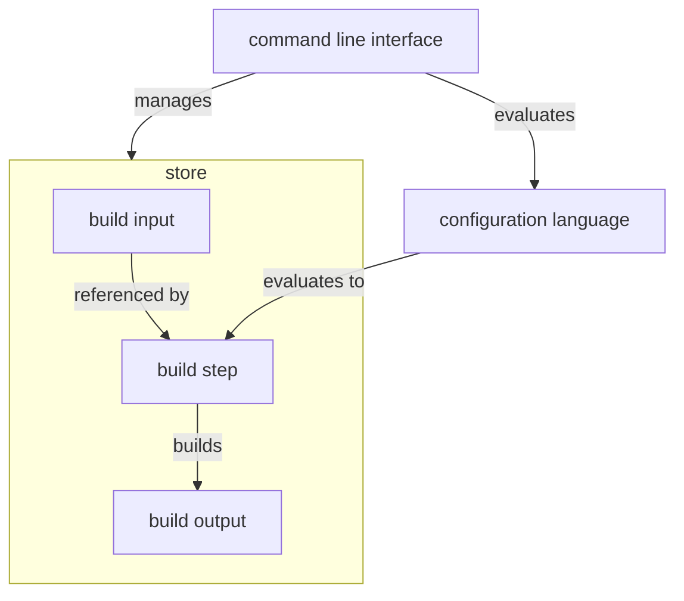
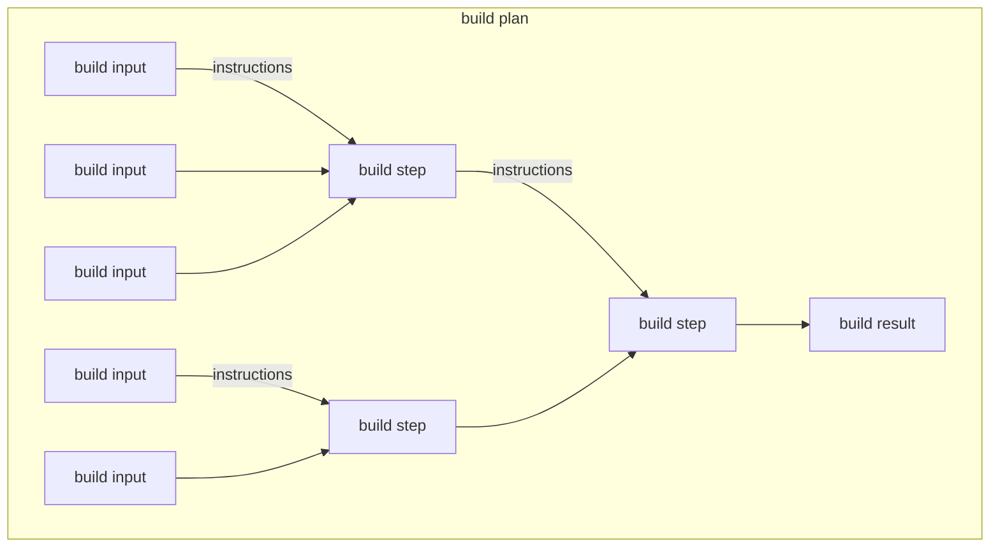

# Architecture

This chapter describes how Nix works.
It should help users understand why Nix behaves as it does, and it should help developers understand how to modify Nix and how to write similar tools.

## Overview

Nix consists of hierarchical [layers](https://en.m.wikipedia.org/wiki/Multitier_architecture#Layers).

At the top is the *command line interface*, translating from invocations of Nix executables to interactions with the underlying layers.

Below that is the *Nix language*, a [purely functional](https://en.m.wikipedia.org/wiki/Purely_functional_programming) configuration language.
It is used to compose expressions which ultimately evaluate to self-contained *build steps*, used to derive *build results* from referenced *build inputs*.

::: {.note}
The Nix language itself does not have a notion of *packages* or *configurations*.
As far as we are concerned here, the inputs and results of a build step are just data.
In practice this amounts to a set of files in a file system.
:::

The command line and Nix language are what users interact with most.

Underlying everything is the *Nix store*, a mechanism to keep track of build steps, data, and references between them.
It can also execute *build instructions*, captured in the build steps, to produce new data.

A series of build steps is a *build plan*.

