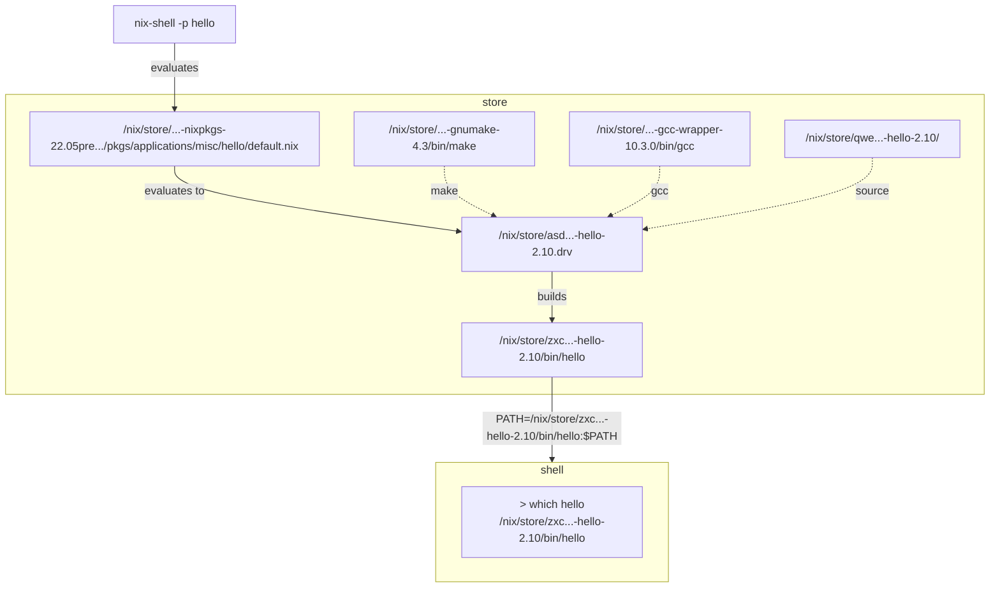
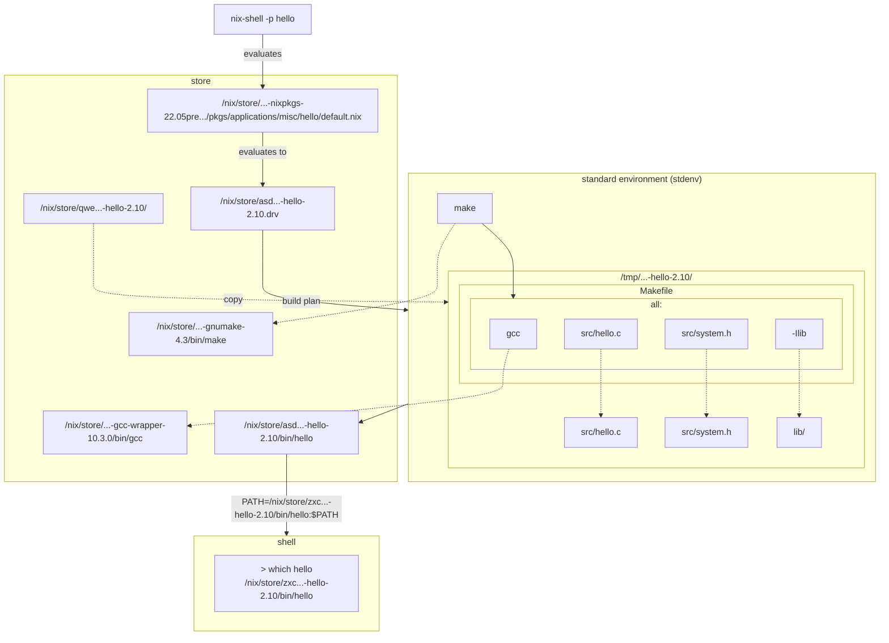

Here is a simplified illustration of how a temporary environment would be built from source.

Looking more closely into how a build is preformed, we notice that simple build systems such as `make` reference build inputs by name. This is fine if they are files in the source release, such as `src/hello.c`, as their contents are determined with respect to the `Makefile` referencing them. External names such as `gcc` on the other hand are subject to interpretation by the surrounding environment, and would usually resolve to something like `/usr/bin/gcc`, which is yet another name that does not tell us anything about contents. The Nix standard build environment is prepared such that these names are resolved to exact versions specified in the build plan.

